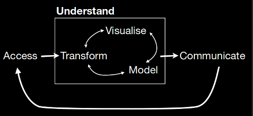

Place as a risk for poverty
=======================================================
transition: fade
transition-speed: fast
incremental: true
css: /home/aurelius/workspace/template/rpresentation/slides.css
Spatial Dynamics of Deprivation/Inequality in Russian Federation

Lecture on class: *Living with Risk: Post-Soviet Welfare State and Daily Life Uncertainties in Russia*  
October 21, 2014

[Markus Kainu](http://markuskainu.fi)  
*PhD Candidate*   

Outline
====

- Introduction - Statement of purpose 
- Core Concepts
- Sociological/social policy research of inequality/poverty - note on spatiality
- Regional inequality in Russian & use of Russian data

Readings
====

- [Linda M. Lobao, Gregory Hooks, and Ann R. Tickamyer, “Poverty and  Inequality across Space: Sociological Reflections on the Missing-Middle Subnational Scale*,” Cambridge Journal of Regions, Economy and Society 1, no. 1 (April 1, 2008): 89–113, doi:10.1093/cjres/rsm003.](http://koti.kapsi.fi/~muuankarski/living-with-risk/kainu1.pdf)
- [N. V. Zubarevich and S. G. Safronov, “Regional Inequality in Large Post-Soviet Countries,” Regional Research of Russia 1, no. 1 (April 21, 2011): 15–26, doi:10.1134/S2079970511010138.](http://koti.kapsi.fi/~muuankarski/living-with-risk/kainu2.pdf)

Statement of purpose I
====

>My PhD research embeds in the discussion of welfare state development in post-socialist space. Within this discussion my study will contribute to the debate on outcomes of income redistribution schemes on household poverty and economic inequality. The current working title of my PhD thesis is: *Poverty, place and income redistribution - Analysis of poverty dynamics and welfare state development in post-socialist transition*.

Statement of purpose II
====

>My theoretical approach embraces the importance of place both, in terms of poverty and inequality. As is commonly known post-socialist transition is a story of widening social inequalities and deepening poverty. In my view, post-socialist transition is, first and foremost, a story of widening spatial inequalities and deepening of place-based poverty (due to local economy, degradation of physical and social services infrastructure; selective labour migration; etc). During the transition the place of residence has become increasingly important determinant of household well-being in addition to traditional socioeconomic determinants, as profession, education or sex. 

Statement of purpose III
====

>My research includes both cross-national comparative and cross-regional country specific studies using surveys as primary body of data. There are recent studies showing that the cross-national differences in living standards between Eastern and Western countries are dimishing, while the territorial, within country, differences have been growing. One aim of social policies is redistribution: lessening the inequalities and reducing of poverty. In this respect I’m particularly interested in how social policies coincide with spatial variation of economic inequality and poverty. As poverty  is increasingly rooted in place besides social structures, should social programs, aimed at alleviating poverty, be analysed both in terms of social and spatial effectiveness?

Core Concepts
====

- inequality
- poverty
- social policy
- space 

====
type: subsection

<h1>Sociological/social policy research of inequality/poverty   - note on spatiality</h1>

Social frame/structure
====

Temporal frame/structure
====

Spatial frame/structure
====

Regional inequality makes it in the news in Finland
====

>[Nokia leikkaa Suomessa 3700 työpaikkaa - Salon tehdas suljetaan](http://www.kansanuutiset.fi/uutiset/kotimaa/2817764/nokia-leikkaa-suomessa-3700-tyopaikkaa-salon-tehdas-suljetaan) - *Kansan Uutiset 14.6.2012*

>[Tehtaiden lopetus sattuu yhä - Viidennes irtisanotuista paperi- ja sellutyöläisistä on vailla työtä. Kaskisissa alamäki on jyrkkä.](http://www.hs.fi/paivanlehti/kotimaa/Tehtaiden+lopetus+sattuu+yh%C3%A4/a1348804162561) - *HS 29.9.2012*

>[Kainuun liitto ei hyväksy te-toimistojen lakkauttamista](http://www.kainuunsanomat.fi/kainuun-sanomat/kainuu/kainuun-liitto-ei-hyvaksy-te-toimistojen-lakkauttamista/) - *Kainuun Sanomat 25.8.2014*

>["Puolella asunnoista ei ole markkina-arvoa" – katso miten asuntojen hinnat ovat kehittyneet alueellasi](http://yle.fi/uutiset/puolella_asunnoista_ei_ole_markkina-arvoa__katso_miten_asuntojen_hinnat_ovat_kehittyneet_alueellasi/7518783) - *YLE 10.10.2014*

Interactions in space
====

>"Everything is related to everything else, but near things are more related than distant things." [Tobler's first law of geography](http://en.wikipedia.org/wiki/Tobler%27s_first_law_of_geography)

## Human interaction and dependence between observations

>Social scientists are interested in situations in which various types of agents - individuals, political parties, groups, countries - interact with one another. In many cases, the outcomes or incentives for actions of individual actors do not depend solely on the attributes of particular individuals, but on the structure of the system, their position within it, and their interactions with other individuals. [Ward, Michael D., and Kristian Skrede Gleditsch. Spatial Regression Models. SAGE, 2008.](http://books.google.fi/books?id=jbFRojt85TUC&pg=PR7&lpg=PR7&dq=books++Spatial+Regression+Models&source=bl&ots=yfpKnNjCiI&sig=9fs5WIF_7Q6i3QGwepvk53RLEMc&hl=fi&sa=X&ei=PmBFVLDNL8zFPZqJgYAL&redir_esc=y#v=onepage&q=books%20%20Spatial%20Regression%20Models&f=false)

- flu
- voting
- poverty

Spatial representations in sociology/social sciences 
====

- comparative cross-national research ([comparative research](http://en.wikipedia.org/wiki/Comparative_research))
- city or local level stratification ([residential segregation](http://en.wikipedia.org/wiki/Residential_segregation))
- use of urban/rural dichotomy still common
    - greatly misleading
        - people not living in rural areas, but in municipalities
        - policies are not implemented in rural/urban context, but in municipalities or other administrative units
    - only applicaple in very equal countries

## Spatial scale

>Spatial scale is important because it defines the territorial resolution by which processes creating inequality work out and the arena for targeting policy and political action (Lobao et all 2008)

- cross-national
- subnational, regional, territorial
- city/local scale

Demand for functional regions
====

>A functional region or Nodal region, is a region that has a defined core that retains a specific characteristic that diminishes outwards. To be considered a Functional region, at least one form of spatial interaction must occur between the center and all other parts of the region. A functional region is organized around a node or focal point with the surrounding areas linked to that node by transportation systems, communication systems, or other economic association involving such activities as manufacturing and retail trading. [Wikipedia](http://en.wikipedia.org/wiki/Region#Functional_region)

## Functional region from welfare perspective?

## Functional region from social policy perspective?

Why spatial dimension is neglegted
====

## Spatial differences small

- regional equality
- short distances
- good connections
- political will in levelling spatial 

## Challanges in research

- Socially & demographically representative data can be collected, but spatially representative data is expensive and has several privacy issues
- Analytical tools have been scarce and expensive
- proper data is still hard to get

====
type: subsection

<h1>Regional inequality in Russian & use of Russian data</h1>

Post-socialist transition & inequalities
====

- Spatial structure Soviet economic system was based on political reasoning
    - there were no transportation costs
    - Emphasis on quantity, not quality
- Spatial structure of Global economic system is based on economic reasoning
    - Approximity to factors of production - land, labour and capital
    - Approximity to markets

Selected socio-economic indicators in Russian Regions
====

|                      | Russia           | Moscow           | Best of regions       | Worst of regions        |
| ----------------     | ---------------- | ---------------- | ----------------      | ----------------        |
| **GDP per capita**   | 18 260           | 37 088           | 46 359 (Tjumen)       | 1 988 (Ingushetia)      |
| *Similar*            | *Poland*         | *Canada*         | *Switzerland*         | *Cambodia*              |
|                      |                  |                  |                       | *Niger*                 |
| **Birth rate**       | 15               | 14               | 33 (Chechen Republic) | 12 (Leningrad)          |
| *Similar*            | *Switzerland*    | *Austria*        | *Haiti*               | *Korea*                 |
|                      | *Spain*          | *Hungary*        | *Bolivia*             |                         |
| **Infant mortality** | 81               | 67               | 40 (Hanty Mansijsk)   | 160 ( Chechen Republic) |
| *Similar*            | *Bulgaria*       | *Latvia*         | *Itävalta*            | *Brazil*                |
|                      | *Kuwait*         | *Chile*          | *Belgia*              | *China*                 |
| **Life expectancy**  | 687              | 736              | 783 (Ingushetia)      | 582 (Chukotka)          |
| *Similar*            | *Belarus*        | *Bulgaria*       | *Portugal*            | *Guinea*                |
|                      | *Moldova*        | *Hungary*        | *Slovenia*            | *Sudan*                 |
  

Analysing regional disparities in welfare in Russia
====

## Raw material - data from
- Rosstat regional statistics
- Regional statistical offices
- Census 2002 & 2010
- Reserch datas
- From other sources as ([DBpedia](http://wiki.dbpedia.org/About))
- see [Avoin data Venäjällä](muuankarski.github.io/venaja-avoin-data/)

## Tools

- Free and open source tools for combining, visualising and exploring the data 
- [Russian Regions app](https://muuankarski.shinyapps.io/regionapp-rus)

## Process

- 
    - [Engineering data analysis - Hadley Wickham](http://vita.had.co.nz/papers/engineering-da.pdf)

Conclusions
====

## Core question

- Who gets what, **and where**?

## Russia

- Extremes of Russian inequality lies both in social & spatial structure
- There are both, poor people and poor areas, and it should be taken into account in research and policy making

## Research 

- Really interesting topics, anyone?

====
type: subsection
incremental: false

<h1>Questions??</h1>

